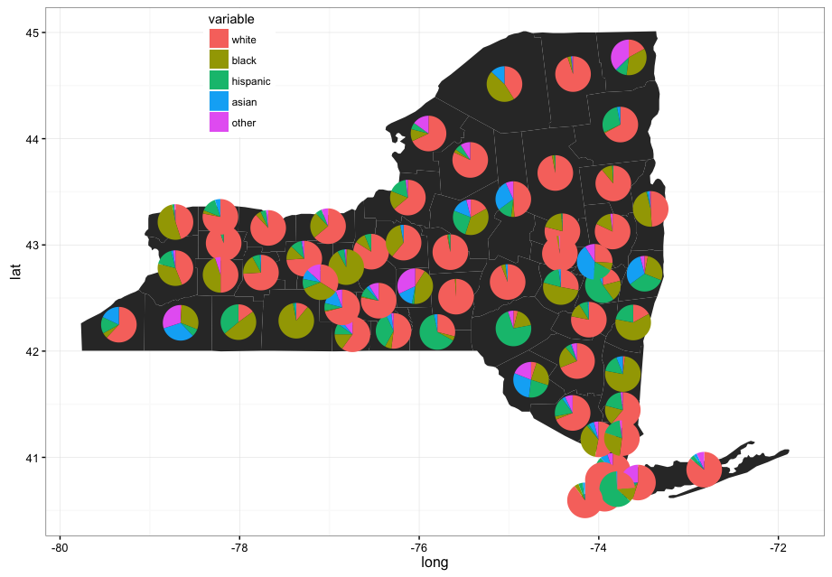

## piesonamap

draw piecharts on map

## Inspiration

http://stackoverflow.com/questions/10368180/plotting-pie-graphs-on-map-in-ggplot

## Usage
```r
library(piesonamap)
data(nycounty)
data(pops)

library(dplyr)
library(ggtree)

# Get Centroids of NY counties using the sp package.
getLabelPoint <- function(county) {sp::Polygon(county[c('long', 'lat')])@labpt}
df <- map_data('county', 'new york')                 # NY region county data
centroids <- by(df, df$subregion, getLabelPoint)     # Returns list
centroids <- do.call("rbind.data.frame", centroids)  # Convert to Data Frame
names(centroids) <- c('long', 'lat')                 # Appropriate Header
centroids$region <- rownames(centroids)

# process NY data and merge with centroids
ny %>% 
  select(region,long,lat,white,black,hispanic,asian,other) %>% 
  group_by(region) %>% 
  slice(1:1) %>%
  reshape2::melt(id.vars = c("region","long","lat")) -> nydata
nydata %>%
  select(-lat, -long) %>%
  left_join(centroids, by=c("region"="region")) %>% 
  select(region, long, lat, variable, value) -> nydata2

# draw the pies on a map
gg <- piesonmap(data=ny,map=ny,piedata=nydata2,locationdata=NULL, circlesize = 0.05)
gg

```


